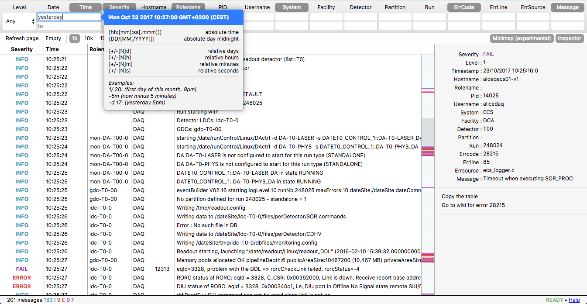

# InfoLoggerGui

Web app for querying infoLogger database and streaming logs in real-time with filtering. Compatible with all browsers, starting from IE 12 (Edge).



 * [Configuration (config.js, oauth and certificate)](docs/configuration.md)
 * [Create, install, remove package](docs/create-install-remove-package.md)
 * [Development guide](docs/developement-guide.md)


```bash
git clone ...
cd InfoLoggerGui
# [configure OAuth, certificate and config.js](docs/configuration.md)
npm install
npm run ils # if fake InfoLoggerServer needed
npm start
```

You need a MySQL and a InfoLoggerServer to connect to. InfoLoggerServer can be faked using `npm run ils`.

Command  | Result
------------- | -------------
npm start | start app in production mode
npm run dev | start app in dev mode with auto-restart on file change
npm run test | will run eslint, mocha and qunit
npm run doc | build the doc in docs/API.md
npm run coverage | report coverage of tests
npm run ils | start local InfoLoggerServer with fake real-time data for dev purpose
npm run demo | start both InfoLoggerGui and a fake InfoLoggerServer

Before starting the InfoLoggerGui (which is a server/client view), you should have a InfoLoggerServer and MySQL running (which store the logs) and configured in config.js

### Credits

Favicon made by Freepik from www.flaticon.com

